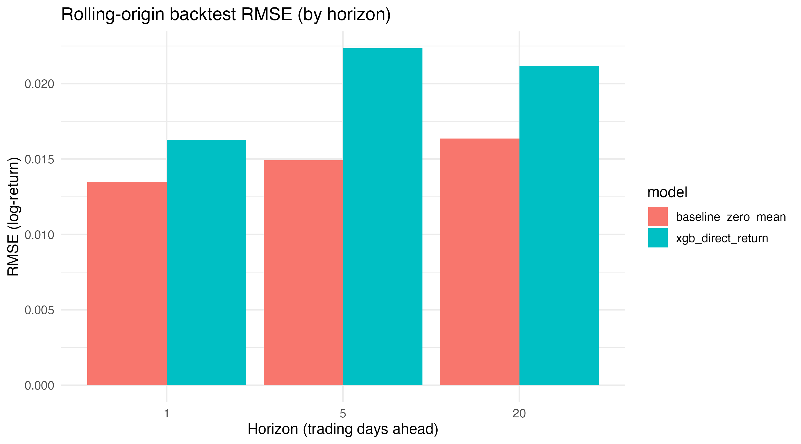
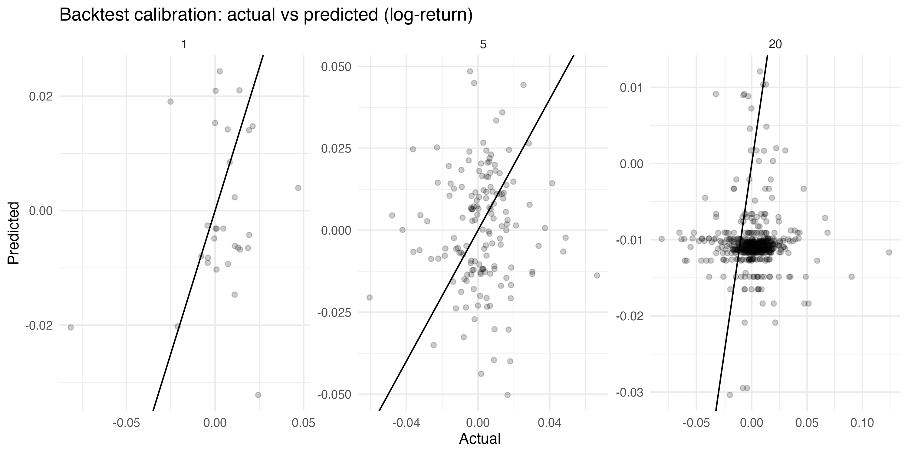

# Model Report

**Data:** `finance.amzn_daily` (daily AMZN prices)
**Target:** direct **h-day-ahead log return** `y_t(h) = lead(ret_1, h)`
**Horizons:** **h = 1, 5, 20** trading days
**Backtest:** rolling-origin (walk-forward) CV, expanding window; fold-safe preprocessing (no leakage)

## Results (Rolling-Origin CV)

* **h = 1:** RMSE = **{rmse_h1}**, MAE = **{mae_h1}** (best model: **{champ_h1}**)
* **h = 5:** RMSE = **{rmse_h5}**, MAE = **{mae_h5}** (best model: **{champ_h5}**)
* **h = 20:** RMSE = **{rmse_h20}**, MAE = **{mae_h20}** (best model: **{champ_h20}**)

**Baseline comparator:** zero-mean returns (`ŷ = 0`). Report delta vs baseline per horizon:

* **ΔRMSE vs baseline (h=1/5/20):** **{d1} / {d5} / {d20}**
* **ΔMAE vs baseline (h=1/5/20):** **{d1_mae} / {d5_mae} / {d20_mae}**

## Model Summary

* **Model:** XGBoost regression (trained separately per horizon; direct strategy)
* **Features:** lagged returns, rolling mean/volatility, momentum sums; calendar one-hot (DOW/month)
* **Saved artifact:** `model.rds` (fitted model per horizon + tuned params + CV config + metrics)

## Artifacts

* 
* 
